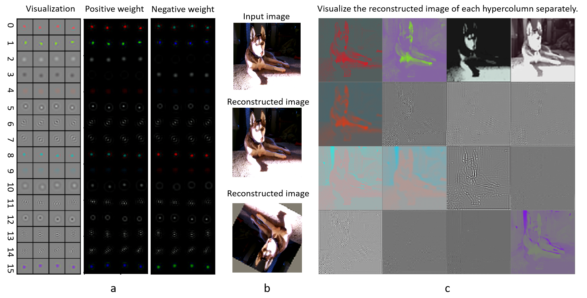
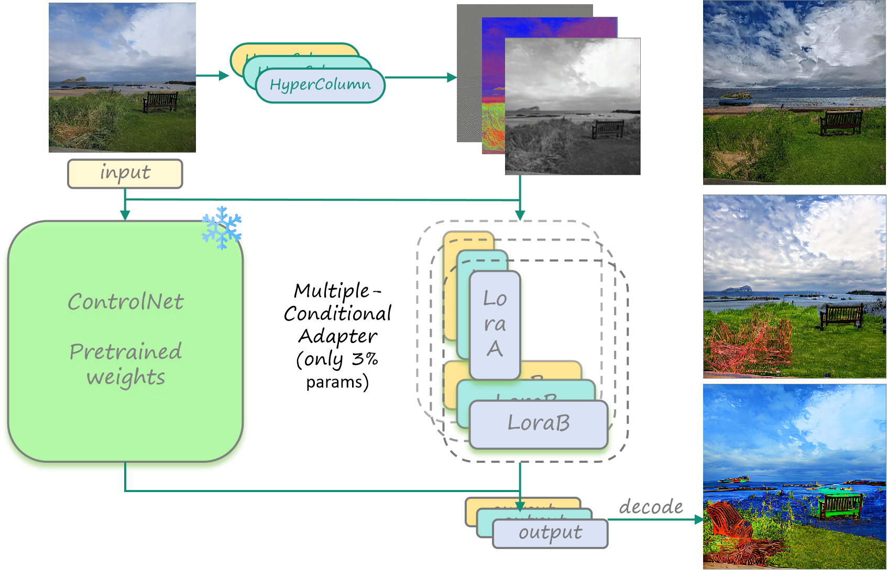
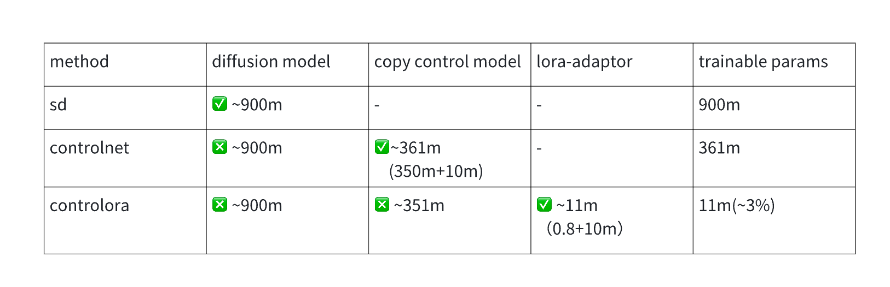
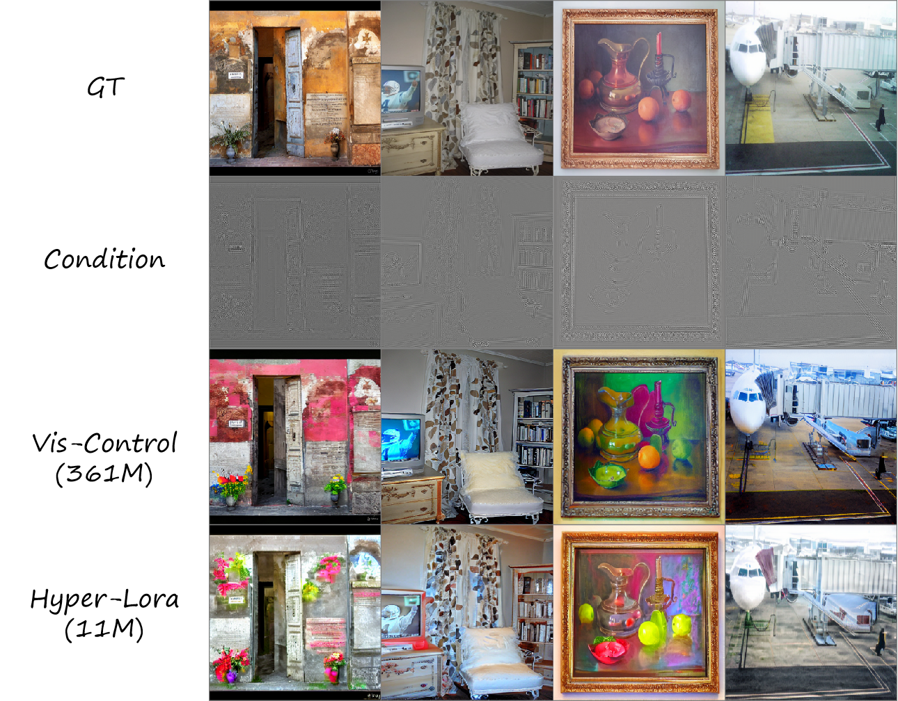
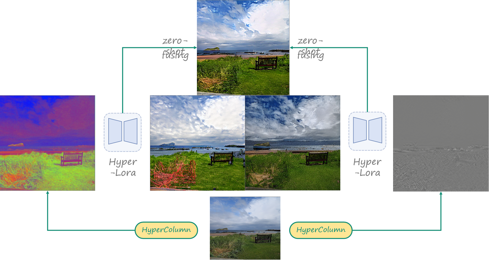
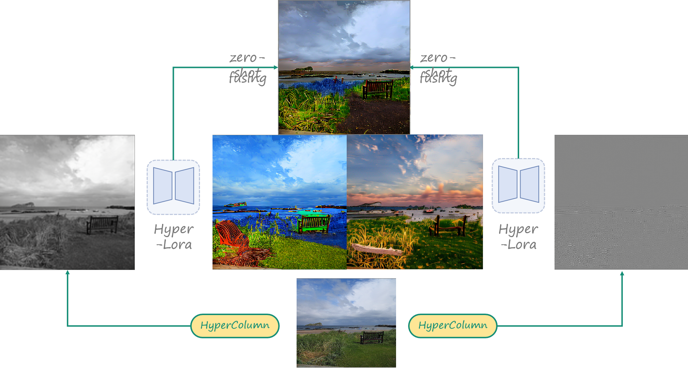

# OPEN-Vis-ControlSD

Our model is built upon our trained modular Hypercolumn-like features and ControlNet. The hypercolumn-like features are trained using a self-supervised method. Based on these features, we train several ControlNets. This approach utilizes a comprehensive modular feature set that is automatically learned and differentiated, resulting in robustness and generalization transfer capabilities. By configuring and combining appropriate control modules, it can effectively transfer to features without prior learning. This is a LoRA version based on ContralNet, which is efficient in learnable parameters for each hypercolumn. This version can easily use multiple hypercolumns to achieve controllable generation.

The modular Hypercolumn-like features are shown as following:

The whole architecture is:

Issues about ControlNet refer to (https://github.com/lllyasviel/ControlNet/blob/main/docs/train.md).

The checkpoint will be released soon.

# Setting

In file tutorial_train.py

resume_path = './image_log/checkpoint__lora1/last.ckpt'
control2_path = 'image_log/checkpoint_lora4/last.ckpt'

# Selected hypercolumns

In file ./models/cldm_v15_lora.yaml

    model:
    target: cldm.cldm_lora_peft.ControLoraLDM
    params:
        control_stage_config:
        target: cldm.cldm_lora_peft.ControLoraNet
        params:
            hypercond: [1]

        control_stage_config2:
        target: cldm.cldm_lora_peft.ControLoraNet
        params:
            hypercond: [4]

# Run

python tutorial_train.py

# Parameters

# Results

Comparison of OPEN-Vis-ControlSD and OPEN-Vis-SDLoRA

Results of multiple hypercolumns

